# Hate Speech Analysis with HappyTransformer

## Introduction

Hate speech covers many forms of expressions which advocate, incite, promote or justify hatred, violence and discrimination against a person or group of persons for a variety of reasons. It poses grave dangers for the cohesion of a democratic society, the protection of human rights and the rule of law.

This is an artificial intelligence based tool that is designed to analyze hate speeches in real-time audios and texts.

In recent years, the increasing propagation of hate speech on social media and the urgent need for effective countermeasures have drawn significant investment from governments, companies, and researchers. A large number of methods have
been developed for automated hate speech detection online. This aims to classify textual content into non-hate or hate speech.


## Features
- Analyze hate speech in real-time audios.
- Analyze hate speech in texts data.


## Technologies & Frameworks

- Python 3.8
- happytransformer
- pyperclip
- pynput
- mysql_connector
- speech_recognition


### What is happytransformer?

Happy Transformer is a package built on top of Hugging Face's transformer library that makes it easy to utilize state-of-the-art NLP models.

### What is pyperclip?

Pyperclip is a cross-platform Python module for copy and paste clipboard functions. It works with Python 2 and 3. Install on Windows: pip install pyperclip. Install on Linux/macOS: pip3 install pyperclip.

### What is pynput?

The pynput library allows you to control and monitor/listen to your input devices such as they keyboard and mouse. The pynput. mouse allows you control and monitor the mouse, while the pynput. keyboard allows you to control and monitor the keyboard.

### mysql_connector?

MySQL Connector/Python is a standardized database driver for Python platforms and development. Additionally, MySQL Connector/Python 8.0 supports the new X DevAPI for development with MySQL Server 8.0.


## Architecture & Model

This hate speech detection system is using a happytransformer framework form Hugging-Face AI community.

As a hate speech classification model, we are using the "Hate-speech-CNERG/dehatebert-mono-english" BERT pre-trained model to do the hate speech analysis, it is an open-source model.

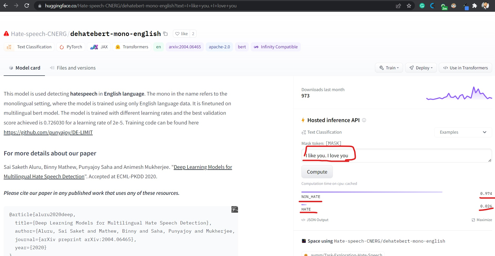

Model Link:- [dehatebert-mono-english](https://huggingface.co/Hate-speech-CNERG/dehatebert-mono-english)

### What is a BERT model?

BERT is an open source machine learning framework for natural language processing (NLP). BERT is designed to help computers understand the meaning of ambiguous language in text by using surrounding text to establish context. The BERT framework was pre-trained using text from Wikipedia and can be fine-tuned with question and answer datasets.

BERT, which stands for Bidirectional Encoder Representations from Transformers, is based on Transformers, a deep learning model in which every output element is connected to every input element, and the weightings between them are dynamically calculated based upon their connection.


### What is a HuggingFaces?

The AI community building the future, build, train and deploy state of the art models powered by the reference open source in machine learning.

## Hate Speech Detection System

In this repository, there are three different types of applications are available. Those are "00-real-time-audio-processing" and "01-real-time-audio-processing-without-knowledgebase-filtering" and "02-text-processing-copy-paste-method", these prototypes are depended on "Hate-speech-CNERG/dehatebert-mono-english" BERT model.

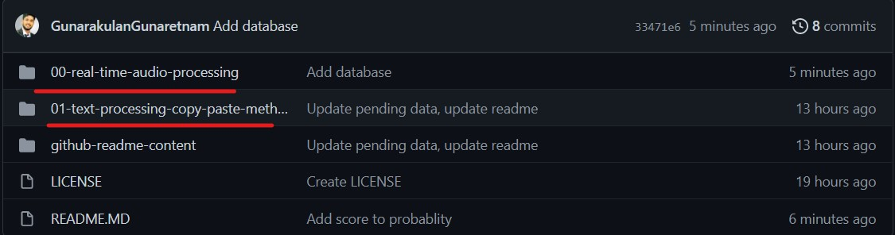

## 00-real-time-audio-processing

This prototype is used to analyze hate speeches in real-time audio. It has a knowledgebase that contains hate keywords. Based on the given keywords, it analyzes & identifies the meaning behind a sentence.

### Features

- Real-time audio analysis
- Youtube videos’ audio analysis

### Architecture

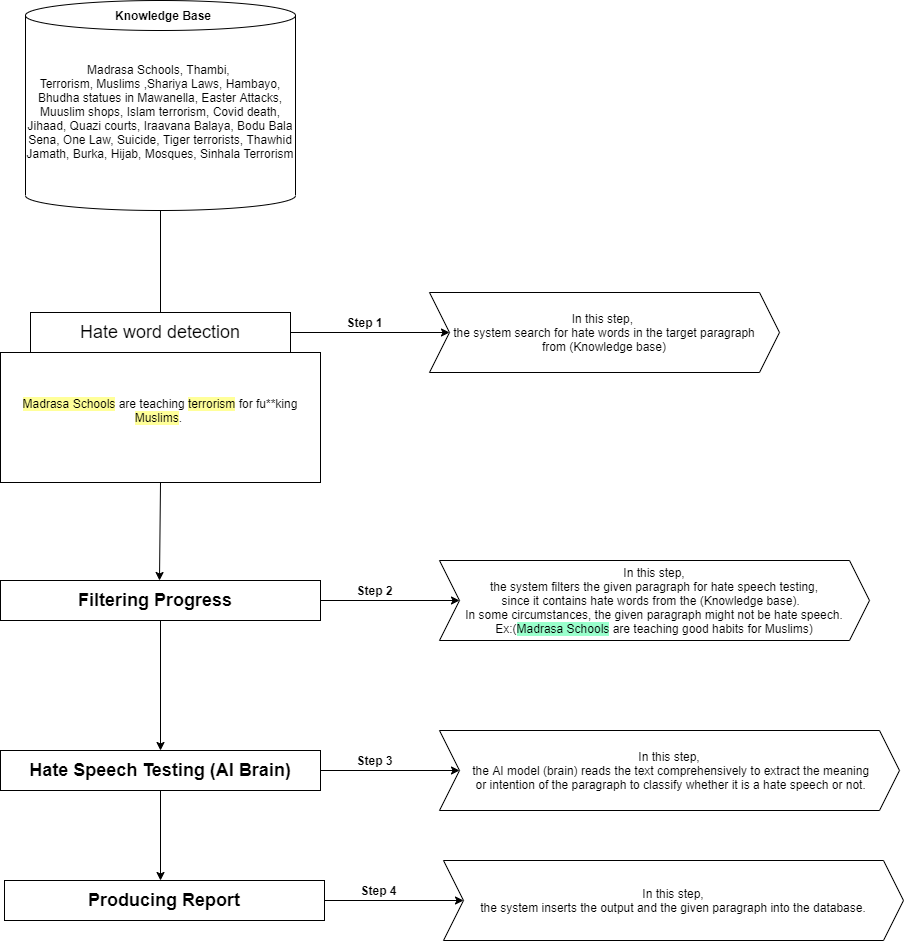

**Note:** This prototype is combined with knowledgebase model and AI based model, first it checks if a hate keyword is matched in the target text from the knowledgebase file, if it is match (Filtering Process), then it goes to the next step to check with the AI model to understand the meaning behind the sentence, the AI model will return probability to determine that targeted text is a hate speech or not.

- **Step 01:** Filtering - Match hate keywords from the knowledgebase.

- **Step 02:** AI Model - Here, the filtered targeted text will be used to check the probability of hate speech with a AI model.


**Note:** If a hate speech sentence not contain any keyboards from the knowledgebase, then It won't send to the AI model for further processing.


### Knowledgebase

The knowledgebase is a text file that is found on the following directory.

```

hate-speech-analysis-with-happytransformer\00-real-time-audio-processing\knowledgebase.txt

```

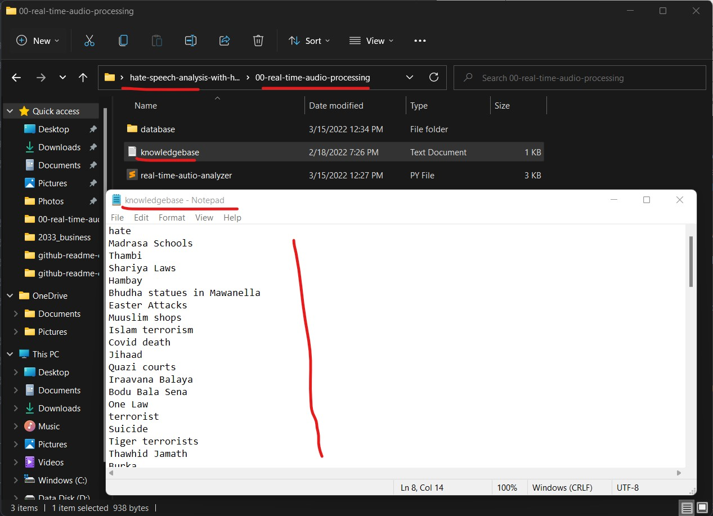

**IMPORTANT NOTE:** Here, new hate keywords could be entered, If we want to introduce new hate keywords, we can simply enter in this knowledgebase.txt file as a new line. However, the AI model is trained with different data. (We are using this model from Hugging face AI community).


### Why Knowledgebase?

The knowledgebase filters a targeted sentence in a Non-AI method to send to the targeted text next step level (AI model).

This prototype is specifically looking for hate speech that contains certain keywords in it.   

- To reduce over-processing issue.
- To make it easier
- To process hate speech in a specific area


### Configuration and Setup

In this step, we will learn, how to step "00-real-time-audio-processing" project.


#### Setup database

The database is found the following directory, deploy this database in the MySQL server.

```

hate-speech-analysis-with-happytransformer\00-real-time-audio-processing\database\hate_speech_database.sql

```

**Step 01:** Create an empty database in the MySQL environment with the name of "hate_speech_database".

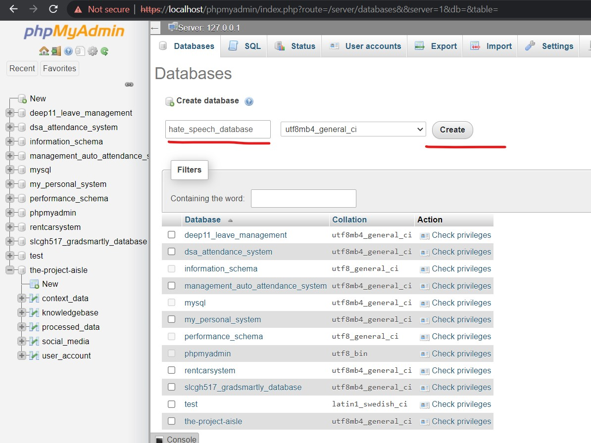


**Step 02:** Import the database into that empty database.
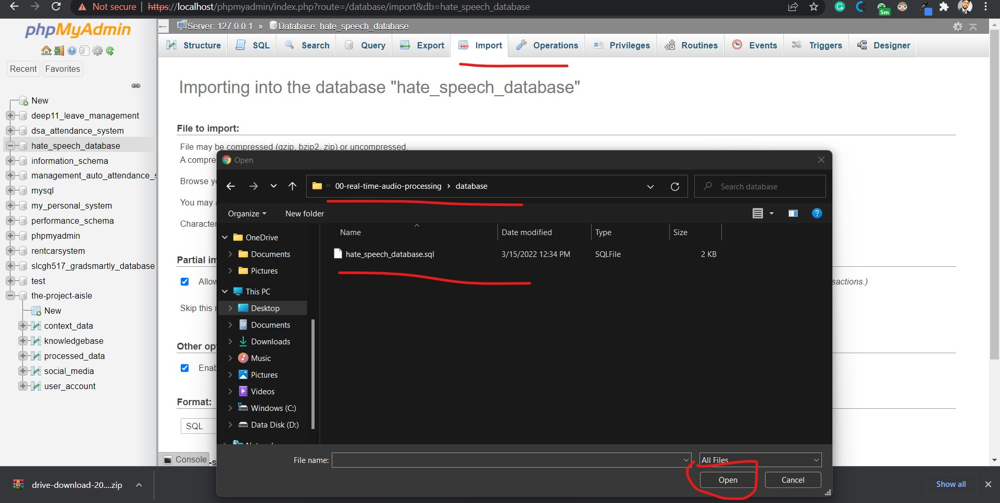


#### Install Dependencies

- Installing HappyTransformer

    ```python
    pip install happytransformer
    ```

- Installing MySQL connector

    ```python
    pip install mysql-connector-python
    ```

- Installing MySQL Speech Recognition

    ```python
    pip install SpeechRecognition
    ```

**Note:** After setting up database and installing dependencies, then the system is ready to be used.

### Running and Execution


**Note:** To run this program, execute the following script.

```python
  hate-speech-analysis-with-happytransformer/00-real-time-audio-processing/real-time-autio-analyzer.py
```

- To run this program:

  ```python
    python real-time-autio-analyzer.py
  ```


### Output

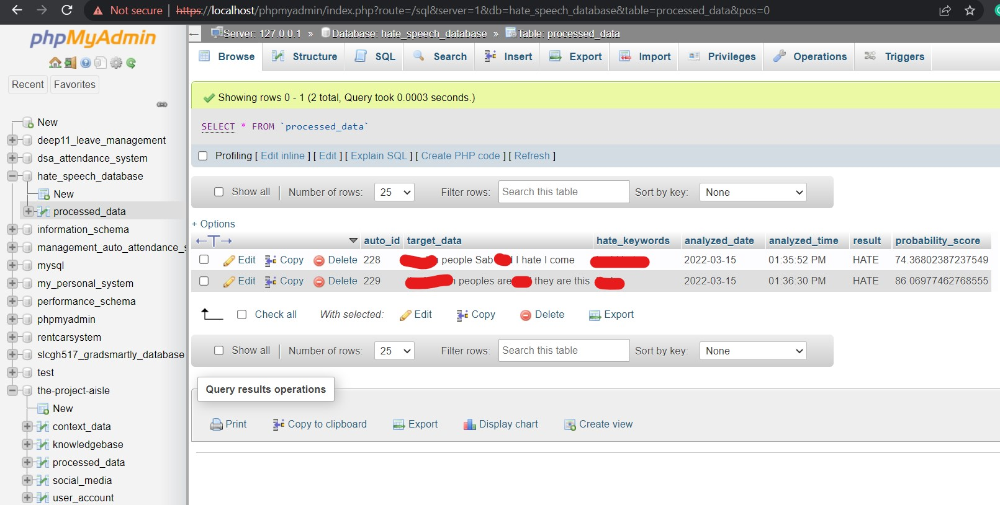


**Note:** Now, this system does not have any backend panel.

## 01-real-time-audio-processing-without-knowledgebase-filtering


This prototype is used to analyze hate speeches in real-time audio. It DOES NOT HAVE a knowledgebase. It is similar to the previous prototype "00-real-time-audio-processing", but it is missing the knowledgebase in the middle

### Features

- Real-time audio analysis
- Youtube videos’ audio analysis

### Architecture

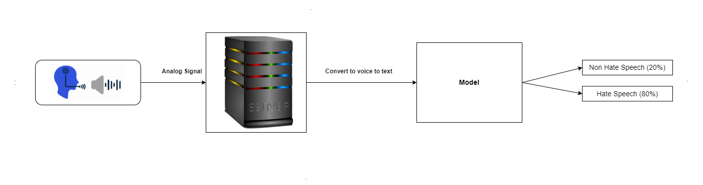

### Configuration and Setup

In this step, we will learn, how to step "01-real-time-audio-processing-without-knowledgebase-filtering" project.


#### Setup database

The database is found the following directory, deploy this database in the MySQL server.

```
hate-speech-analysis-with-happytransformer\01-real-time-audio-processing-without-knowledgebase-filtering\database\without_knowledgebase_hate_speech_database.sql
```

**Step 01:** Create an empty database in the MySQL environment with the name of "without_knowledgebase_hate_speech_database".

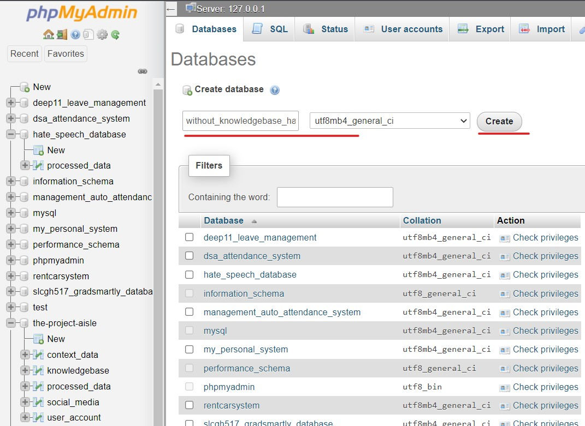


**Step 02:** Import the database into that empty database.

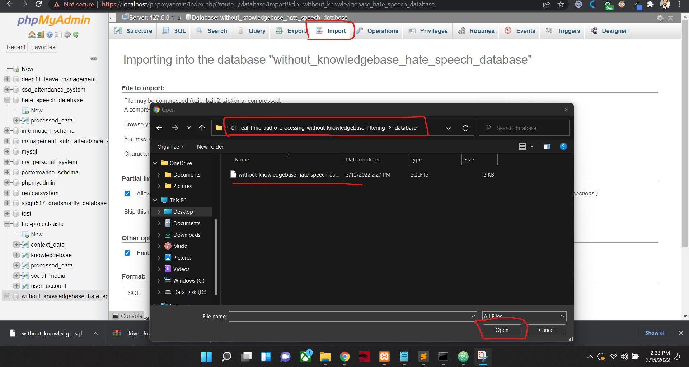

#### Install Dependencies

- Installing HappyTransformer

    ```python
    pip install happytransformer
    ```

- Installing MySQL connector

    ```python
    pip install mysql-connector-python
    ```

- Installing MySQL Speech Recognition

    ```python
    pip install SpeechRecognition
    ```

**Note:** After setting up database and installing dependencies, then the system is ready to be used.

### Running and Execution


**Note:** To run this program, execute the following script.

```python
  hate-speech-analysis-with-happytransformer/01-real-time-audio-processing-without-knowledgebase-filtering/real-time-autio-analyzer-without-knowledgebase.py
```

- To run this program:

  ```python
    python real-time-autio-analyzer-without-knowledgebase.py
  ```

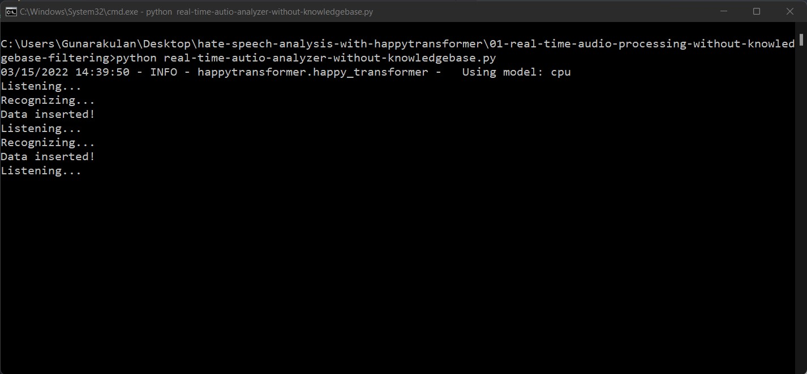

### Output

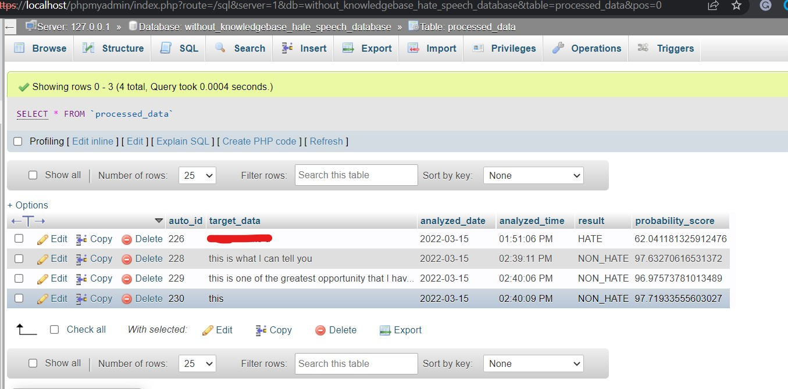


## 02-text-processing-copy-paste-method

This is a text processing method of hate speech detection. In this prototype, no real-time audio is available.

The system works as the following, when the user presses (CTRL + C), it gets text content from the clipboard and start hate speech process in the background.

This is simple prototype, it does not have any database.

The main advantage of this system is, we can copy text data from social medias, or any other platforms.

### Features

- Social media data can be analyzed.
- Any sort of text data can be analyzed.

#### Install Dependencies

- Installing HappyTransformer

    ```python
    pip install happytransformer
    ```
- Installing pyperclip

  ```python
  pip install pyperclip
  ```

- Installing pynput

  ```python
  pip install pynput
  ```


### Running and Execution

**Note:** To run this program, execute the following script.

  ```python
    hate-speech-analysis-with-happytransformer/02-text-processing-copy-paste-method/run.py
  ```


### Output


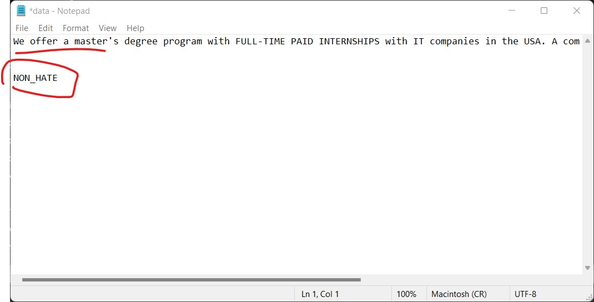

**NOTE:** The output file is found in the following directory.


```
hate-speech-analysis-with-happytransformer\02-text-processing-copy-paste-method\data.txt
```

Social Media Links
---

* [Linkedin Profile](https://www.linkedin.com/in/gunarakulangunaretnam/)
* [Facebook Page](https://www.facebook.com/gunarakulangunaretnam)
* [Twitter Profile](https://twitter.com/gunarakulang)
* [Instagram Profile](https://www.instagram.com/gunarakulangunaretnam/)
* [Youtube Channel](https://www.youtube.com/channel/UCMWkED5sabgVZSCKjZuRJXA)
